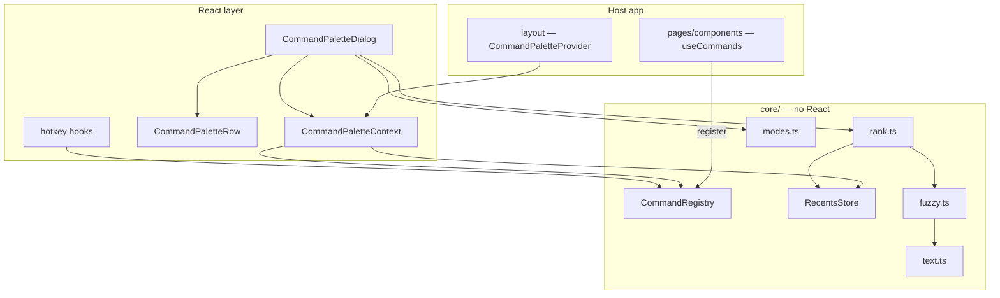

# Architecture

## Module map

```
src/
  types.ts                     Public contracts. Start here.
  theme.ts                     CSS-vars ⇄ classic MUI theme bridge
  labels/
    index.ts                   Merge helper + partial-label types. No copy.
    en.ts                      English table   → subpath /en
    he.ts                      Hebrew table    → subpath /he
  core/                        No React. Portable and testable on its own.
    text.ts                    Normalisation (Unicode marks, Hebrew specifics)
    fuzzy.ts                   Scoring + per-character match indices
    modes.ts                   Prefix ⇄ lane parsing
    registry.ts                The contribution store
    recents.ts                 localStorage MRU, folded into ranking
    rank.ts                    Filter → score → sort → group
    index.ts                   Subpath entry point /core
  CommandPaletteContext.ts     React context + the guard hook
  CommandPaletteProvider.tsx   Owns registry/recents/open state; renders the palette
  use-commands.ts              Contribute commands while mounted
  use-command-palette.ts       Imperative open/close/toggle/runCommand
  use-command-hotkeys.ts       Binds every contributed `shortcut`
  use-open-palette-hotkeys.ts  Window-level open shortcuts
  CommandPaletteDialog.tsx     The MUI sheet: field, list, hint bar
  CommandPaletteRow.tsx        One result row
  HighlightedText.tsx          Match highlighting
  KeyChip.tsx                  Keycaps and key sequences
  index.ts                     Package entry point
```

Three entry points are published: `.` (everything React), `./core` (the
React-free half), `./en` and `./he` (locale data only).

## Layering



The dependency arrows only ever point downward. `core/` knows nothing about
React; the React layer knows nothing about any host app; no module imports a
locale table.

## Data flow, one keystroke

1. `InputBase.onChange` fires. The dialog rebuilds the raw value with
   `buildRawQuery(query.kind, value)`, preserving the active lane, and stores it.
2. `parseQuery(rawQuery)` splits it back into `{ kind, text }`.
3. `registry.collect(query)` materialises contributions — arrays as-is,
   factories called with the query — dropping duplicate ids (first wins).
4. `rankCommands` filters to the lane, scores, sorts, caps at 60.
5. With an empty query, previously-run commands are re-grouped under the
   `recents` label.
6. `groupRanked` buckets into sections; `flattenGroups` produces the flat,
   index-ordered list that selection and `aria-activedescendant` use.
7. Rows render, with `titleMatches` driving `HighlightedText`.

On ++enter++: the id is recorded in recents, the palette closes unless
`keepOpen`, then `run()` is invoked.

## Decisions

### The registry is a plain class, not React state

`CommandRegistry` mutates a `Map` in place and notifies subscribers. The dialog
holds a version counter bumped by `subscribe`, because in-place mutation gives
no other signal that the contents changed.

The alternative — commands in context state — would re-render every consumer of
that context on every contribution, and would make the contribution model
awkward for factories. As a plain class it is also testable and reusable without
a renderer, which is what `./core` exposes.

Unregistration guards against a re-registration under the same id having already
replaced the entry, because React's double-invoked effects in development do
exactly that.

### The matcher is hand-rolled

Zero runtime dependencies is a real constraint for a package consumed by three
apps, and the palette needs three things a general library does not give at once:
per-character match indices for highlighting, scoring tuned for short titles, and
script-specific folding (Hebrew niqqud, gershayim, final forms). ~120 lines is a
fair trade for owning all three.

It is also **deliberately duplicated** from the search code of the app it
was extracted from. Sharing one implementation
would couple this package to that app. If the gantt search ever wants this
matcher, it can import `matchText` from here — that dependency direction is fine.

### Copy lives behind subpaths, never in `src/`

See [Language & Localisation](localisation.md#only-the-language-you-import-is-built-in).
The short version: selecting between languages at runtime requires both at build
time, so the choice is an import. `tests/labels.test.ts` enforces that no shipped
module reaches a locale table.

### `@/*` internally, relative externally

Internal imports use the `@/*` alias, enforced by
`no-restricted-imports`. TypeScript does not rewrite path aliases on emit, so
`npm run build` runs `tsc-alias` after `tsc`, turning every `@/…` in the emitted
`.js` and `.d.ts` into a relative specifier. Consumers never see the alias.

### `"use client"` on every component module

The package targets Next.js App Router hosts. Each component and hook module
carries the directive so importing them from a server component tree works
without the host wrapping anything. TypeScript preserves the directive through
compilation — verified by the build.

### Tests import `dist/`, not `src/`

`pretest` builds first. Testing the emitted output catches a broken `tsc-alias`
pass, a missing export or a bad `exports` map — failures that a test suite
pointed at `src/` cannot see. The React layer has no test harness here; UI
behaviour is covered by the consuming apps' E2E suites.

## Extending the package

Before adding anything, check it against three rules: it imports nothing but
`react` and `@mui/*`, it contains no user-facing copy, and it knows nothing
about any host app's domain. Anything failing one of those belongs in the host
app beside its own command contributions.

Likely-good additions: a new lane kind, a scoring knob exposed on `rankCommands`,
another locale table, an option on `PaletteHotkeyOptions`.

Likely-bad additions: routing, data fetching, persistence beyond the MRU, an
`sx` passthrough that freezes the DOM structure into the public API.
