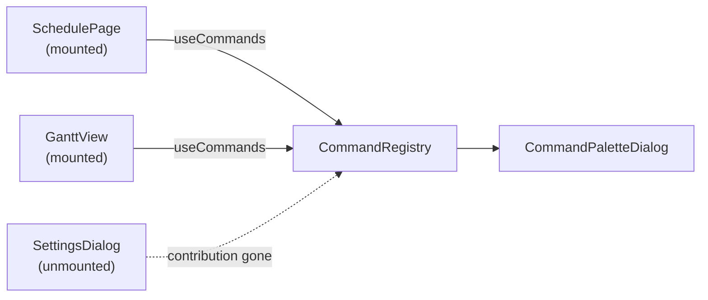

# Contributing Commands

## The contribution model

The palette does not own a list of commands. It owns a **registry**, and
components contribute to it for as long as they are mounted:



This is VSCode's model, and it exists for one reason: the palette lives in the
layout, but the actions live in pages. A global command table would have to
reach into page-local state it cannot see. Contribution inverts that — the
component that already holds `setDialogOpen` is the one that registers the
command that calls it.

Consequences worth knowing:

- **Commands are only offered when they can be performed.** A command that needs
  the gantt view's selection simply is not in the registry when you are not on
  the gantt view.
- **Ids may be shadowed.** If two contributors register the same `id`, the first
  one collected wins, which lets a page override a global command.
- **Unmount is cleanup.** There is no "unregister" call to forget.

## The `Command` shape

```ts
type Command = {
    id: CommandId;                       // stable identity — recents + dedup key
    title: string;                       // primary label, in the app's locale
    subtitle?: string;                   // secondary line; matched at low weight
    group?: string;                      // section heading in the result list
    keywords?: Array<string>;            // extra match tokens, never displayed
    kind?: CommandKind;                  // "command" (default) | "entity" | "goto"
    icon?: ReactNode;
    shortcut?: Array<string>;            // e.g. ["Ctrl", "Z"] — displayed *and* bound
    enabled?: boolean;                   // false ⇒ greyed out, not selectable
    priority?: number;                   // static ranking nudge; default 0
    keepOpen?: boolean;                  // keep the palette open after running
    run: () => Promise<void> | void;
};
```

### `id`

Stable across renders and releases. It is the key for recents (so a renamed
command keeps its history) and for de-duplication. Namespace it by feature —
`schedule.event.new`, `settings.theme.toggle` — so shadowing is deliberate
rather than accidental.

### `title` vs `keywords`

`title` is displayed and matched at full weight. `keywords` are matched at 85%
weight and never rendered. That combination is what makes a Hebrew-titled
command reachable by typing English:

```tsx
{
    id: "schedule.event.new",
    title: "אירוע חדש",
    keywords: ["new event", "create", "add"],
}
```

Also the right place for synonyms your users type but you would not put in a
label — `"prefs"` for a settings command, `"logout"` for "Sign out".

### `group`

Purely presentational grouping, but it is also matched (at 40% weight), so
typing a section name surfaces its whole section. Groups are ordered by their
best-scoring member, so the section you are searching for floats to the top.

### `kind` and lanes

| Kind | Prefix | Meaning |
| --- | --- | --- |
| `command` (default) | `>` | An action to perform. |
| `entity` | `@` | A domain object to jump to — a student, a course, a room. |
| `goto` | `:` | Navigation to a place in the app. |

Typing the prefix as the first character narrows the palette to that lane. With
no prefix, every lane is searched at once — lanes are a power-user affordance,
not a requirement. The prefix never appears in the input field; it is lifted
into a chip beside it (see [Theming & RTL](theming.md#the-lane-chip)).

### `shortcut`

A display hint **and** a live binding. Declaring it is enough:

```tsx
{ id: "editor.undo", title: "Undo", shortcut: ["Ctrl", "Z"], run: undo }
```

The provider installs a single window-level `keydown` listener that matches
every contributed shortcut. Recognised modifier tokens are `ctrl`/`control`,
`shift`, `alt`/`option`, `meta`/`cmd`/`⌘`; the remaining token is the key,
compared case-insensitively against `event.key`. Modifiers must match exactly —
`["Ctrl", "Z"]` does not fire for ++ctrl+shift+z++.

!!! note "Shortcuts do not fire while typing"
    The handler ignores the event when focus is in an `<input>` or `<textarea>`.
    Bare-key shortcuts are therefore possible, but think twice: they will still
    fire against a `contenteditable` or a custom editor that is neither tag.

### `enabled`

`false` renders the row greyed out and non-selectable, and sorts it below
everything runnable. Prefer this over dropping the command when the user might
reasonably look for it — a visible disabled row answers "where did it go?",
while an absent one just looks broken.

### `priority`

A static nudge added to the score as `priority * 20`. Use small integers, and
sparingly: it is for genuinely primary actions, not for winning fights with the
matcher.

### `keepOpen`

By default the palette closes before `run` is invoked. Toggles (dark mode,
compact view) are nicer with `keepOpen: true` so the user can flip several
things without reopening.

### `run`

May be sync or async. The palette does not await it — it fires the call and
closes. So:

- **Errors are yours to handle.** An unhandled rejection inside `run` will not
  surface in the palette. Catch and route to your app's error toast.
- **Long work needs its own feedback.** The palette is gone by the time your
  request is in flight; show a spinner or a toast from the host app.

## Static arrays vs. factories

`useCommands` accepts either:

```ts
type CommandSource = Array<Command> | ((query: CommandQuery) => Array<Command>);
```

Use an **array** for a fixed set. Use a **factory** when materialising every
candidate eagerly would be wasteful — thousands of calendar events, a directory
of students:

```tsx
const searchStudents = useCallback(
    (query: CommandQuery): Array<Command> => {
        // Only bother when the user is actually in the entity lane, and only
        // once there is something to search for.
        if (query.kind !== "entity" || query.text.length < 2) return [];

        return findStudents(query.text)
            .slice(0, 20)
            .map((student) => ({
                id: `student.${student.id}`,
                title: student.name,
                subtitle: student.className,
                kind: "entity" as const,
                group: "Students",
                run: () => router.push(`/students/${student.id}`),
            }));
    },
    [router],
);

useCommands(searchStudents);
```

The factory is called on every keystroke while the palette is open, so keep it
cheap — index your data once outside the factory rather than scanning inside it.

!!! warning "Factories must be stable too"
    Wrap them in `useCallback`. An inline arrow function is a new identity every
    render.

## Running a command without the palette

`useCommandPalette().runCommand(id)` invokes a currently-contributed command by
id, without opening any UI. Useful for a toolbar button that should do exactly
what the palette entry does, without duplicating the `run` body:

```tsx
const { runCommand } = useCommandPalette();

<Button onClick={() => runCommand("schedule.event.new")}>New event</Button>;
```

If the command is not currently contributed, or is disabled, the call is a no-op.

## Naming conventions

These are conventions, not enforcement — but they keep a palette with a few
hundred entries navigable.

- **Titles are verb-first for actions**: "Create course", not "Course creation".
- **Titles are the noun for entities**: the student's name, not "Student: Dana".
- **Ids are `area.object.verb`**: `curriculum.syllabus.new`.
- **Groups are user-facing areas**, matching your navigation, not your module
  layout.
- **Do not put the shortcut in the title.** Use `shortcut`; the palette renders
  the keycaps itself.
