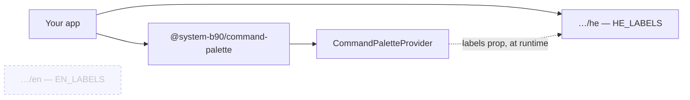

# Language & Localisation

## Two tables ship

```tsx
import { EN_LABELS } from "@system-b90/command-palette/en";
import { HE_LABELS } from "@system-b90/command-palette/he";
```

Pick one, pass it as `labels`, done:

```tsx
<CommandPaletteProvider labels={HE_LABELS} storageNamespace="bluz">
```

## Only the language you import is built in

This is the constraint the design is built around, and it explains three
otherwise-odd API choices.

Each table lives in its own module, behind its own package subpath. The palette
components reference **neither** — `labels` arrives as a prop, and nothing in
`src/` imports `labels/en.js` or `labels/he.js`. The package is
`sideEffects: false` and ESM. Together that means a bundler starting from your
entry point has no route to the language you did not import, so it never lands
in your output.



`EN_LABELS` is unreachable from the graph above, so it is not in the bundle.

!!! question "Why not `<CommandPaletteProvider language=\"he\">`?"
    Because selecting between two values at runtime requires both values to
    exist at build time. A `language` prop would put the English and Hebrew
    strings in every bundle, which is exactly what this design avoids. The
    choice has to be an **import**, not a value.

!!! question "Why is `labels` required, with no default?"
    A default would mean the package itself imports one of the tables — and
    then that language ships with every consumer, including the ones that
    picked the other. Requiring the prop is what keeps `src/` free of copy.

The invariant is enforced, not just documented: `tests/labels.test.ts` walks the
built `dist/` and fails if any module outside `dist/labels/` imports either
table.

## Overriding individual strings

`withLabelOverrides` overlays a partial table onto a complete one, so you can
re-word a string without restating the rest:

```tsx
import { withLabelOverrides } from "@system-b90/command-palette";
import { EN_LABELS } from "@system-b90/command-palette/en";

const LABELS = withLabelOverrides(EN_LABELS, {
    placeholder: "Search students, courses or actions…",
    hints: { run: "open" },
});
```

Nested objects (`kinds`, `hints`) merge field by field; siblings you do not
mention are kept. The base table is never mutated. Define the result at module
scope, or memoise it — it must be referentially stable.

## Adding a third language

There is nothing to register. A locale is just a `CommandPaletteLabels` object:

```tsx title="src/i18n/palette-labels.ts"
import type { CommandPaletteLabels } from "@system-b90/command-palette";

export const AR_LABELS: CommandPaletteLabels = {
    placeholder: "اكتب أمرًا أو ابحث…",
    empty: "لا توجد نتائج",
    recents: "الأخيرة",
    kinds: { command: "الأوامر", entity: "الكيانات", goto: "الانتقال إلى" },
    hints: { navigate: "تنقل", run: "تنفيذ", close: "إغلاق" },
};
```

If it would be useful to more than one app in the org, add it to the package
instead — a new `src/labels/<code>.ts` plus an `exports` entry, following the
existing two. Do **not** re-export it from `src/index.ts`; that would break the
one-language-per-build property for everyone.

## Switching language at runtime

Some apps let the user change language without a reload. That works — `labels`
is an ordinary prop — but you are then knowingly shipping both tables:

```tsx
import { EN_LABELS } from "@system-b90/command-palette/en";
import { HE_LABELS } from "@system-b90/command-palette/he";

const { locale } = useLocale();
const labels = useMemo(() => (locale === "he" ? HE_LABELS : EN_LABELS), [locale]);

<CommandPaletteProvider labels={labels} storageNamespace="my-app">
```

Two strings' worth of tables is a small cost; the point is that it is now your
decision rather than the package's. If you want the switch *and* the saving, a
dynamic `import()` keyed on locale gives you both, at the cost of an async hop.

## What the labels cover

| Field | Rendered as |
| --- | --- |
| `placeholder` | The query field's placeholder, and its `aria-label`, and the result listbox's `aria-label`. |
| `empty` | The empty-state line, beside a "no results" icon. |
| `recents` | The group heading applied to previously-run commands when the query is empty. |
| `kinds.command` / `.entity` / `.goto` | The chip shown beside the field when a lane prefix is active. |
| `hints.navigate` / `.run` / `.close` | The three labels in the footer hint bar, next to their keycaps. |

`CommandPaletteLabels` is exhaustive — if a string is not in that type, the
palette does not render it. Command titles, subtitles and group names are the
host app's copy and arrive with the commands themselves.

## Content language vs. UI language

The two are independent. The matcher normalises text before comparing, and its
handling of Hebrew (niqqud, gershayim, final-form letters) and of Unicode
combining marks applies to **command titles**, whatever `labels` you passed. An
English-labelled palette searching Hebrew course names works exactly as well as
the reverse. See [Ranking & Matching](ranking.md#normalisation).
