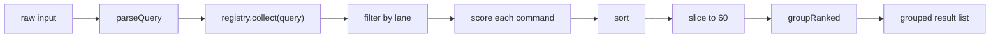

# Ranking & Matching

Everything on this page lives in `src/core/`, is free of React, and is
importable on its own from `@system-b90/command-palette/core`.

The pipeline, per keystroke:



## Normalisation

Before anything is compared, both the query and the target are folded
(`core/text.ts`):

| Step | Effect |
| --- | --- |
| Lowercase | `New Event` → `new event` |
| Drop Hebrew points and cantillation (U+0591–U+05C7) | `בֵּית` → `בית` |
| Drop quote-likes, including geresh/gershayim (`'` `"` `` ` `` `׳` `״` and the curly forms) | `בית"ר` → `ביתר` |
| Drop bidi control characters | Cleans up copy-pasted RTL text |
| Unify Hebrew final forms (ך ם ן ף ץ → כ מ נ פ צ) | `ירושלים` is reachable by typing `מ` |
| Decompose and strip Unicode combining marks | `résumé` matches `resume` |
| Collapse whitespace | `New   Event` → `new event` |

Two functions expose this:

- `normalizeText(text)` returns the folded string. Length is **not** preserved.
- `normalizeChars(text)` returns one entry per input character (the empty string
  for dropped ones), which keeps indices aligned with the original string. That
  alignment is what lets the UI highlight the exact characters that matched,
  even when the target contained niqqud that was folded away.

!!! note "Why not `Intl.Collator` or a library?"
    The matcher needs per-character match indices, which collators do not
    provide, and the palette wants scoring tuned for short titles rather than
    for prose. Rolling it keeps the package at zero runtime dependencies —
    see [Architecture](architecture.md#decisions).

## Matching a single string

`matchText(query, target)` returns `{ score, indices }`. A score of `0` means no
match; the query must be a subsequence of the target for anything else. An
**empty query matches everything with score 1**, which is what lets the "nothing
typed yet" listing use the same code path.

Two strategies, in order:

**1. Contiguous hit.** If the folded query appears as a substring:

```
score = 120                                     (contiguous bonus)
      + 90 if that run starts a word            (prefix bonus)
      + queryLength × (3 + 14)                  (per-char + run bonus)
      − matchOffset × 0.4                       (distance penalty)
```

**2. Subsequence fallback.** Greedy left-to-right; each matched character earns:

```
+3   always                                     (baseline)
+14  if it continues the previous match         (run bonus)
+10  if it starts a word                        (word-start bonus)
−0.4 × offset, for the first matched character  (distance penalty)
```

A "word start" is index 0 or a character preceded by a space, `-` or `/`.

The greedy pick is deliberate: an optimal alignment needs a DP pass, and for
strings the length of command titles the difference is not observable.

Every score is floored at `1` when the match succeeded, so a match never
degrades into "no match" through penalties alone.

## Scoring a command

`rankCommands` scores each field and keeps the best, with non-title fields
discounted so a title hit always beats an equally-good hit elsewhere:

| Field | Weight |
| --- | --- |
| `title` | 1.0 |
| `keywords` (best of) | 0.85 |
| `subtitle` | 0.6 |
| `group` | 0.4 |

Then two bonuses are added:

```
score = bestFieldScore
      + recentsBoost(id)          // 30 / (1 + positionInMRU), 0 if never run
      + priority × 20
```

`titleMatches` — the indices used for highlighting — come from the title match
only, so a command surfaced by a keyword shows an unhighlighted title rather
than a misleading one.

### Recency

`RecentsStore` keeps up to 40 ids, most recent first, in
`localStorage["command-palette:recents:<namespace>"]`. The boost decays as
`30 / (1 + index)`: 30 for the most recent, 15 for the next, 10, 7.5, and so on.

That is bounded on purpose. It comfortably breaks ties between two commands you
match equally well, and it cannot overcome a materially better text match — the
contiguous bonus alone is 120. Habit should reorder near-ties, not hijack search.

When the query is **empty**, recency is surfaced explicitly instead: every
previously-run command is re-grouped under the `recents` label, so the user sees
their habits as a section rather than as invisible reordering of an otherwise
arbitrary list.

Storage failures — private mode, quota, corrupt JSON — are swallowed and degrade
to an empty history. During SSR (`typeof window === "undefined"`) the store
reports empty and writes nothing.

## Sorting and grouping

Sort order:

1. Enabled before disabled.
2. Higher score first.
3. `localeCompare` on the title, as a stable tiebreak.

Then the list is capped at **60** results (`limit` is configurable when calling
`rankCommands` directly) and bucketed into contiguous group blocks by
`groupRanked`. Because the input is already sorted, **group order follows each
group's best-scoring member** — the section you are searching for floats to the
top without any per-group ordering configuration.

`flattenGroups` turns the grouped structure back into the flat, index-ordered
list that keyboard selection and `aria-activedescendant` are indexed by.

## Tuning notes

- **A command is hard to find.** Add `keywords` first. They are matched at 0.85
  and cost nothing visually.
- **A command should lead its group.** Small `priority` (1–2). Remember it is
  multiplied by 20, so `priority: 5` is worth more than a word-start bonus on
  every character of the query.
- **Too many near-identical results.** Give them distinct `subtitle`s; the
  subtitle is matched at 0.6 and disambiguates visually as well.
- **Do not fight the matcher with `priority`.** If the right result is not
  winning on text, the text is usually the thing to fix.

## Reusing the matcher

Both the matcher and the ranking pipeline are exported, so an in-page search
field can rank identically to the palette:

```ts
import { matchText, normalizeText } from "@system-b90/command-palette/core";

const hits = rooms
    .map((room) => ({ room, ...matchText(query, room.name) }))
    .filter((hit) => hit.score > 0)
    .sort((a, b) => b.score - a.score);
```

See [Recipes](recipes.md#headless-use-of-the-matcher) for a fuller example,
including highlighting with the returned indices.
